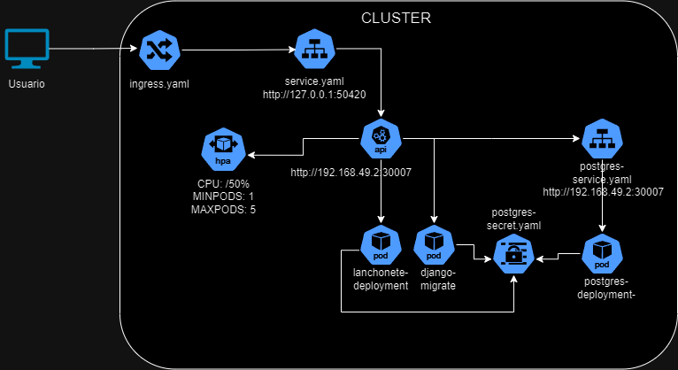

# Fiap Tech Challenge - Sistema de Autoatendimento para Lanchonete

## **Descrição do Projeto**

Este projeto consiste em uma API para um sistema de autoatendimento de uma lanchonete, permitindo que os clientes façam pedidos, acompanhem o status do pagamento e que a lanchonete gerencie os pedidos.

---

## **Arquitetura**

### **Desenho da Arquitetura**



### **Requisitos do Negócio**

- **Cadastro de Produtos e Categorias:**
  - Permitir que produtos sejam cadastrados com nome, descrição, preço, categoria e imagem.
- **Gerenciamento de Pedidos:**
  - Clientes podem realizar pedidos informando os produtos desejados.
  - Acompanhar o status dos pedidos: Recebido, Em preparação, Pronto, Finalizado.
- **Pagamento:**
  - Integração simulada com sistema de pagamento, recebendo confirmações via webhook.
- **Listagem de Pedidos:**
  - Retornar os pedidos com ordenação específica:
    1. Pronto > Em Preparação > Recebido.
    2. Pedidos mais antigos primeiro.
    3. Pedidos com status Finalizado não aparecem na lista.

### **Requisitos de Infraestrutura**

- **Containerização:**
  - Aplicação containerizada usando Docker.
- **Orquestração com Kubernetes:**
  - Utilização do Minikube para simular um cluster Kubernetes localmente.
  - Configuração de Deployments, Services e HPA para escalabilidade.
- **Banco de Dados:**
  - Uso do PostgreSQL como banco de dados relacional.
  - Implantação do PostgreSQL dentro do cluster Kubernetes.
- **Escalabilidade:**
  - Configuração do Horizontal Pod Autoscaler para aumentar ou diminuir o número de Pods conforme a demanda.
- **Clean Architecture:**
  - Projeto estruturado seguindo os princípios da Clean Architecture, facilitando a manutenção e a escalabilidade.

---

## **Estrutura de Pastas**
```
fiap_tech_challenge_2/
├── api/
│   ├── customers/
│   │   ├── migrations/
│   │   ├── __init__.py
│   │   ├── admin.py
│   │   ├── apps.py
│   │   ├── models.py
│   │   ├── serializers.py
│   │   ├── tests.py
│   │   └── views.py
│   ├── orders/
│   │   ├── migrations/
│   │   ├── __init__.py
│   │   ├── admin.py
│   │   ├── apps.py
│   │   ├── models.py
│   │   ├── serializers.py
│   │   ├── tests.py
│   │   └── views.py
│   ├── products/
│   │   ├── migrations/
│   │   ├── __init__.py
│   │   ├── admin.py
│   │   ├── apps.py
│   │   ├── models.py
│   │   ├── serializers.py
│   │   ├── tests.py
│   │   └── views.py
│   ├── fiap_tech_challenge_2/
│   │   ├── __init__.py
│   │   ├── asgi.py
│   │   ├── settings.py
│   │   ├── urls.py
│   │   └── wsgi.py
│   ├── manage.py
│   └── requirements.txt
├── infrastructure/
│   └── kubernetes/
│       ├── deployment.yaml
│       ├── service.yaml
│       ├── migration-job.yaml
│       ├── configmap.yaml
│       └── secret.yaml
├── Dockerfile
├── docker-compose.yml
├── README.md
└── .gitignore
```

## **APIs Desenvolvidas**

### **Documentação com Swagger**

A API está documentada utilizando o Swagger UI, disponível em:

- **URL local:** 
- `http://127.0.0.1:52165/swagger/`
## **Guia de Execução do Projeto**

### **Pré-requisitos**

- **Minikube:** Instalado e configurado.
- **Kubectl:** Ferramenta de linha de comando para interagir com o Kubernetes.
- **Docker:** Necessário para construir a imagem da aplicação.

### **Passo a Passo**

#### **1. Iniciar o Minikube**

```bash
minikube start
```
#### **2. Configurar o Docker para Usar o Ambiente do Minikube**

```bash
eval $(minikube docker-env)
```

#### **3. Construir a Imagem Docker da Aplicação**

Na raiz do projeto, execute:

```bash
docker build -t lanchonete-api:latest .
```

#### **4. Aplicar as Configurações do Kubernetes**

Navegue até a pasta `infrastructure/kubernetes/` e execute:

```bash
kubectl apply -f postgres-secret.yaml
kubectl apply -f postgres-deployment.yaml
kubectl apply -f postgres-service.yaml
kubectl apply -f django-configmap.yaml
kubectl apply -f deployment.yaml
kubectl apply -f service.yaml
kubectl apply -f migration-job.yaml
kubectl apply -f hpa.yaml
```

#### **5. Verificar os Recursos Implantados**

```bash
kubectl get all
```

#### **6. Executar as APIs**

Siga a ordem de execução conforme necessário:

1. **Criar Produtos e Categorias:** Use os endpoints de criação de produtos e categorias.
2. **Realizar um Pedido (Checkout):** `POST /api/orders/checkout/`
3. **Consultar Status de Pagamento:** `GET /api/orders/{order_id}/payment-status/`
4. **Simular Notificação de Pagamento:** `POST /api/orders/payment-webhook/`
5. **Atualizar Status do Pedido:** `PATCH /api/orders/{order_id}/update-status/`
6. **Listar Pedidos:** `GET /api/orders/`

---

## **Vídeo Demonstrativo**

Assista ao vídeo demonstrando a arquitetura desenvolvida e o funcionamento da aplicação:

- [Link para o Vídeo no YouTube](https://youtu.be/JHrurbrV_gI)

---
